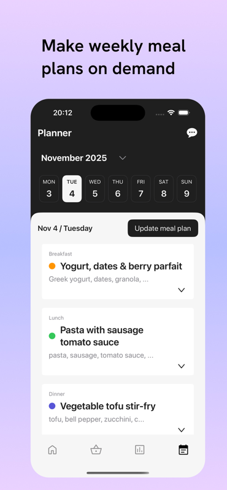
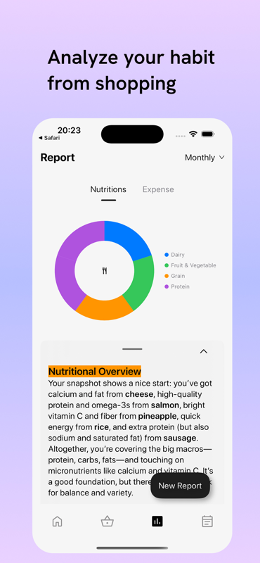
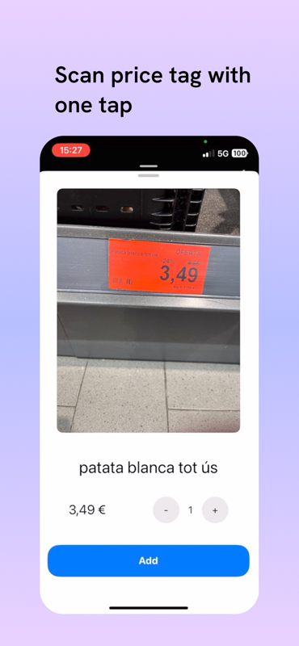
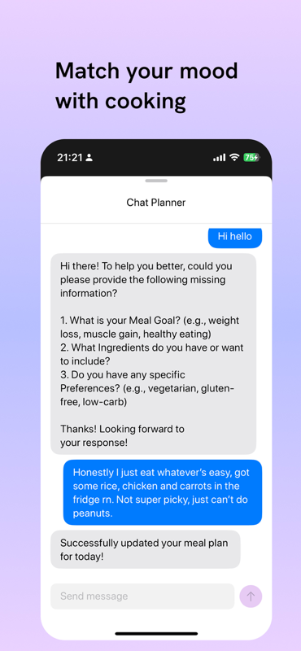
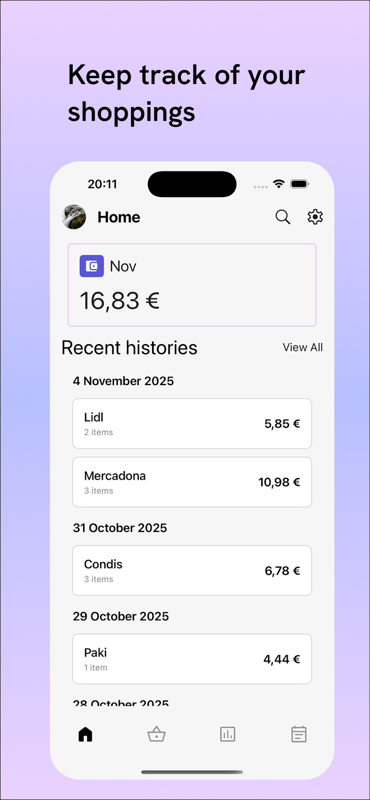
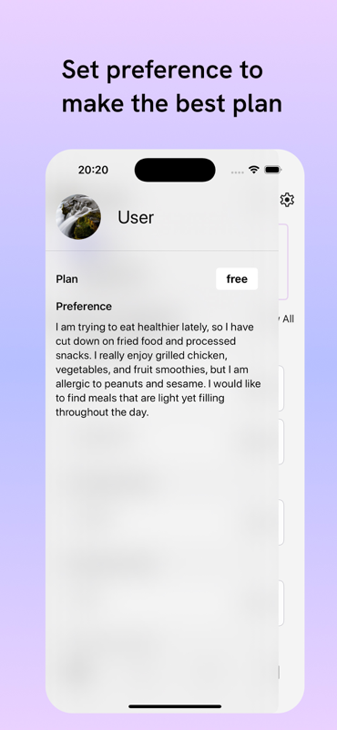
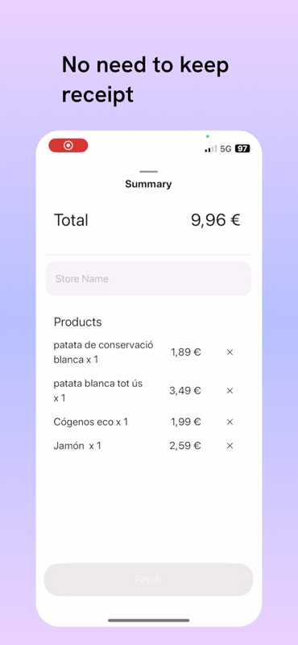

# .sh

** phone number OTP not available due to cost issue **

## Gallery

      

### Demo Video

[Download Demo Video](./demo-asset/sh-demo.mov)

## Test flight: https://testflight.apple.com/join/jT5xYUxr

## Description:

Transform the Way You Shop and Eat
.sh is your intelligent grocery companion that makes healthy eating effortless. Say goodbye to meal planning stress and nutritional guesswork – we've built the complete solution for smarter shopping and better eating.
Key Features:

- Product Scanning
  Instantly scan any product to get detailed nutritional information and make informed choices at the store.
- Purchase Analysis
  Track your shopping habits and understand your nutritional intake with intelligent purchase analysis.
- Generate Analysis Reports
  Get comprehensive reports on your eating patterns, nutritional balance, and health metrics to stay on track with your goals.
- Meal Management
  Organize and manage your meals with ease. Keep track of what you're eating and plan ahead effortlessly.
- AI Meal Assistant
  Chat with your personal nutrition assistant. Get instant answers about ingredients, recipes, and dietary questions.
- Personalized Weekly Meal Plans
  Receive custom meal plans tailored to your preferences, dietary needs, and nutritional goals. Takes the guesswork out of weekly planning.
  Why Choose .sh?

* Save Time - No more endless meal planning or nutritional research
* Eat Healthier - Make informed decisions with real-time nutritional data
* Stay Organized - Keep all your meals, preferences, and reports in one place
* Personalized Experience - Get recommendations that fit YOUR lifestyle
  Whether you're trying to eat healthier, manage dietary restrictions, or simply make grocery shopping easier, .sh is your partner in building better eating habits.
  Download .sh today and experience the future of grocery shopping – it's smart, simple, and designed to change the way you eat!
